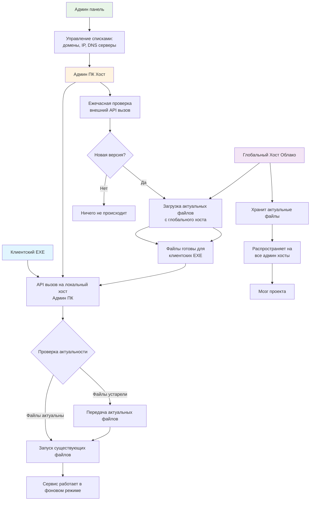

# ⚡ Преимущества архитектуры

## Высокая производительность
- **Низкие задержки** - Все файлы передаются локально внутри сети клуба
- **Минимальное время отклика** - клиентские EXE обращаются к локальному админ-ПК
- **Отсутствие зависимости от скорости интернета** для ежедневной работы

## Самая быстрая передача файлов
- Файлы распространяются по локальной сети на гигабитных скоростях
- Клиенты получают обновления мгновенно с локального сервера
- **Экономия внешнего трафика** - файлы скачиваются только один раз на админ-ПК

# 🛡️ Безопасность и контроль

## Децентрализованное управление
Админ-ПК хосты могут самостоятельно настраивать:
- ✅ Список доменов (Domain List)
- ✅ IP-адреса и сети

## Защита от несанкционированного использования
- **Клиентский EXE не работает вне клубной сети!**
- При установке домой клиентский EXE не сможет подключиться к системе
- Автоматическая блокировка при отсутствии локального админ-ПК
- Гарантия целевого использования только в рамках клубной инфраструктуры

# 📈 Масштабируемость и надежность

## Обход ограничений API
**Преимущества распределенной архитектуры:**

| Традиционный подход | Наш подход |
|---------------------|------------|
| ❌ Единый сервер | ✅ Множество локальных хостов |
| ❌ Лимиты запросов | ✅ Нет лимитов - локальные |
| ❌ Единая точка отказа | ✅ Децентрализованная система отказа |

## Защита от блокировок
- **Независимость от разработчиков** - админы могут сами обновлять DNS и домены
- **Резервные каналы связи** - multiple DNS серверов и IP-адресов
- **Автономная работа** - система продолжает работать даже при потере внешнего соединения

# 💡 Ключевые особенности

| Особенность | Преимущество |
|-------------|--------------|
| Локальная передача файлов | Максимальная скорость, минимальная задержка |
| Децентрализованное обновление | Нет ограничений API, нет единой точки отказа |
| Самостоятельная настройка | Независимость от разработчиков, гибкость |
| Защита от копирования | EXE работает только в клубной сети |
| Автоматическое обновление | Всегда актуальная версия без участия пользователя |

