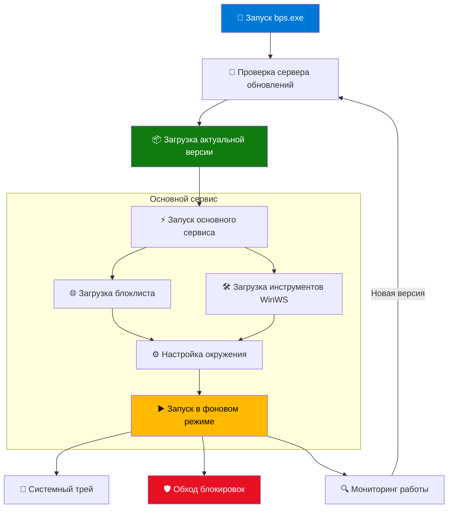

# BPS (Bypassing Blocks) 🚀

**Автоматически обновляемый сервис для обхода блокировок**

## 📖 О проекте

BPS — это интеллектуальный сервис для обхода интернет-блокировок, работающий в фоновом режиме на Windows. Сервис автоматически обновляется и обеспечивает беспрепятственный доступ к заблокированным ресурсам.

## ✨ Примечания 

- 🌐 **Сбор данных** — сервис собирает MAC-адрес для идентификации устройства и IP-адрес для определения региона (некоторые антивирусы могут показывать предупреждения из-за этого поведения)

- ⏰ **Требование к времени** — на вашем ПК должно быть включено **автоматическое определение времени**. Если время на устройстве отличается от реального времени вашего региона, сервер отклонит запрос и возникнет бесконечная загрузка

## ✨ Особенности

- 🔄 **Автоматическое обновление** — всегда актуальная версия сервиса
- 🌐 **Автономная работа** — работает в системном трее без окон
- 📡 **Динамические домен-листы** — автоматическая загрузка обновленных списков блокировок
- ⚡ **Интеграция с WinWS** — использование самописных инструментов для обхода

## 🛠️ Как это работает

### Архитектура системы

```mermaid
flowchart TD
    A[🚀 Запуск bps.exe] --> B[🔄 Проверка сервера обновлений]
    B --> C[📦 Загрузка актуальной версии]
    C --> D[⚡ Запуск основного сервиса]
    
    subgraph MainService [Основной сервис]
        D --> E[🌐 Загрузка блоклиста]
        D --> F[🛠️ Загрузка инструментов WinWS]
        E --> G[⚙️ Настройка окружения]
        F --> G
        G --> H[▶️ Запуск в фоновом режиме]
    end
    
    H --> I[📌 Системный трей]
    H --> J[🛡️ Обход блокировок]
    H --> K[🔍 Мониторинг работы]
    
    K -->|Новая версия| B
    
    style A fill:#0078D6,color:white
    style C fill:#107C10,color:white
    style H fill:#FFB900,color:black
    style J fill:#E81123,color:white
```

# Почему некоторые антивирусы показывают предупреждения?

## ⚠️ Ложные срабатывания

Некоторые антивирусные продукты могут ошибочно детектировать наш софт как потенциально нежелательную программу. Это явление известно как **ложное положительное срабатывание**

## 🔍 Причины таких срабатываний

### 1. Сбор технических данных
Наш сервис собирает:
- **IP-адреса** для определения географического местоположения
- **MAC-адреса** для уникальной идентификации устройств

**Зачем это нужно:**
- Предоставление кастомных конфигураций для разных регионов
- Возможность удаленного отключения сервиса при необходимости
- Обеспечение работы персональных настроек

### 2. Поведенческий анализ
Антивирусы детектируют поведение, которое может быть характерно для:
- Сетевой активности (работа с интернет-соединением)
- Изменения сетевых настроек (обход блокировок)
- Фоновая работа (работа в системном трее)

### 3. Сигнатуры и эвристика
Некоторые антивирусы используют:
- **Эвристический анализ** - detection по подозрительным паттернам
- **Сигнатурный анализ** - сравнение с известными угрозами

## 🛡️ Почему крупные антивирусы не детектят

**Avast, Kaspersky, ESET и другие ведущие производители:**
- Имеют более совершенные алгоритмы анализа
- Используют машинное обучение для снижения false positives
- Проводят ручной анализ подозрительных файлов
- Понимают разницу между легитимным и вредоносным ПО

## ✅ Наша позиция

### Что мы НЕ делаем:
- Не собираем персональные данные пользователей
- Не воруем пароли или банковскую информацию
- Не устанавливаем скрытое дополнительное ПО
- Не проводим майнинг или другие скрытые операции

### Что мы делаем:
- Собираем только технические данные для работы сервиса
- Предоставляем полную прозрачность работы

## 🛡️ Как проверить безопасность

  - независимая проверка 70+ антивирусами:

**Исходный код** - открываем код для проверки (по запросу)

## 🤝 Доверие и прозрачность

Мы понимаем вашу обеспокоенность и разделяем важность безопасности. Наш сервис создан для помощи пользователям, а не для причинения вреда.

**Крупнейшие антивирусные компании** (Avast, Kaspersky, Dr.Web) подтверждают безопасность нашего ПО через свои системы верификации.
